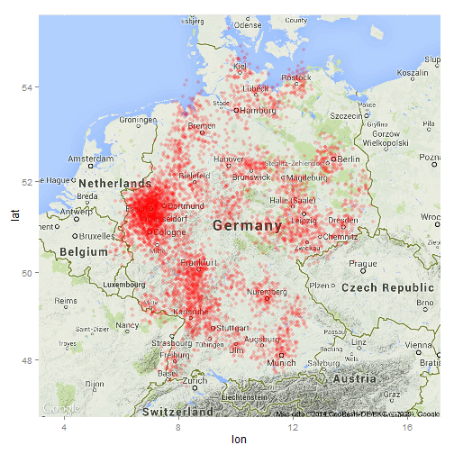

## What the App does

**Main Purpose** of this app:
* generates random points around some cities
* to be used for visualization purposes if you don't have data

**How it's done** (overview):
* Step 1: get the GPS coordinates 
  * from a `.html` file (included with the app, 
but downloaded from [here](http://www.google.com.tr/url?sa=t&rct=j&q=&esrc=s&source=web&cd=1&cad=rja&uact=8&ved=0CBwQFjAA&url=http%3A%2F%2Fwww.astrologon.com%2Fpositionen.htm&ei=5PufU-WSH-fy7AaWm4CwDQ&usg=AFQjCNHS_L79tP4JByIyzX7WvvTAUV19bg&bvm=bv.68911936,d.ZGU))
  * and parse the file to actually get the coordinates in lat/lon format
* Step 2: Generate points by adding random error to lat/lon coordinates
* Step 3: download the corresponding part from Google Maps
* Step 4: Display

--- 

## Step 1: Get GPS Coordinates

* using `XML` package's `htmlParse()` function to get the nodes 
(NOTE: publishing changed the encoding, so I used a binary R file in the actual app)
* then decoding it using string functions (omitted for brevity)


```r
doc.text <- readLines("geolocs-astrologon.html")
doc <- htmlParse(doc.text)
tab.nodes.lines <- getNodeSet(doc, "//table/tr")  ## see the whole node, including html tags:
tab.nodes.lines.entries <- lapply(tab.nodes.lines[-1], getNodeSet, "td")
tab.nodes.lines.entries[[1]]
```

```
## [[1]]
## <td>Aachen, Deutschland                     </td> 
## 
## [[2]]
## <td align="right">50° 47´ N</td> 
## 
## [[3]]
## <td align="right">   6° 05´ O</td> 
## 
## [[4]]
## <td> MEZ   </td> 
## 
## attr(,"class")
## [1] "XMLNodeSet"
```

--- 

## Step 2: Generate Points

In a `reactive({})` function:
* using the `input` object, select the data of the selected country
* generate a sample of `nrows` objects
* construct data frame with lat/lon objects plus $N(0,0.25)$ random error


```r
construct.data <- reactive({
  locbase.sel <- locbase[grep(input$sel.country, locbase$country, fixed=TRUE),]
  loc.idx <- sample(seq_along(locbase.sel$city), size=input$sel.nrows, replace=TRUE)
  dat.all <- data.frame(idx = seq_along(loc.idx))
  dat.all$country <- locbase.sel$country[loc.idx]
  dat.all$city <- locbase.sel$city[loc.idx]
  dat.all$lat <- (locbase.sel$lat[loc.idx] + rnorm(input$sel.nrows, mean=0, sd=0.25))
  dat.all$lon <- (locbase.sel$lon[loc.idx] + rnorm(input$sel.nrows, mean=0, sd=0.25))
  return(dat.all)   
})
```


--- 

## Step 3: Download from Google Maps

In a `renderPlot({})` function:
* calculate a bounding box `bbox` for the geospatial data
* and construct the plot object (**NOTE**: This may take some time...)


```r
    map.google <- get_map(location = bbox, zoom = 6)
```

```
## converting bounding box to center/zoom specification. (experimental)
## Map from URL : http://maps.googleapis.com/maps/api/staticmap?center=51.273134,10.139709&zoom=6&size=%20640x640&scale=%202&maptype=terrain&sensor=false
## Google Maps API Terms of Service : http://developers.google.com/maps/terms
```

```r
    p2 <- ggmap(map.google) + labs(title = input$wch.country)
    p2 <- p2 + geom_point(data=dat.all, aes(y = lat, x = lon), alpha=0.2, size=2, col="red")
```

--- 

## Step 4: Display


```r
    plot(p2)
```

 


